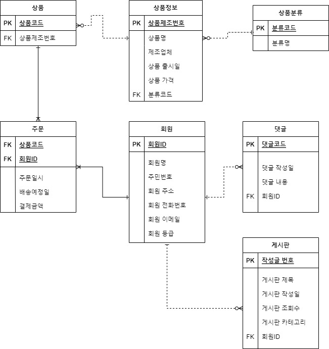

# ERD 생성 근거 및 JPA Entity 생성 관련 어노테이션




주제는 마켓컬리나 쿠팡과 같은 쇼핑몰 사이트 시스템으로 가정을 했다


#### 상품 - 상품정보

- 상품정보 테이블의 기본키가 상품 테이블에서 일반 속성으로 쓰이고 있다 -> 점선

- 하나의 상품정보에 여러 개의 상품이 있을 수 있다. -> 일대다 관계

- 상품정보는 필수이고 상품 테이블은 실제 물리적 데이터를 나타내기 때문에 상품에 문제가 생겨 사라지는 경우도 있다

  ->필수 : 선택


#### 상품 - 주문 - 회원

- 원래는 상품과 회원 사이의 관계로 "주문하다"를 할려고 했지만 관리해야 할 속성이 많아서 따로 개체를 만들었다
- 하나의 상품에 여러 개의 주문이 들어올 수 있고 한 명의 회원이 여러 개의 주문을 할 수 있다. -> 상품, 회원 1: 주문 N
- 상품과 회원의 기본키를 외래키로 받아서 기본키로 쓰기 때문에 실선을 사용한다.


#### 회원 - 게시판, 댓글

- 한 명의 회원은 여러 개의 댓글과 게시판글을 작성할 수 있다. -> 회원 1: 댓글, 게시판 N
- 게시판과 댓글도 관계가 있다고 생각했지만 그러면 써클이 생겨서 관계를 설정하지 않았다.
- 댓글과 게시판 글을 작성할 때 회원 정보는 필수이고 회원이 댓글과 게시판 글을 안 쓸 수도 있다. ->필수 : 선택


### JPA Entity 생성 관련 어노테이션

JPA를 활용해서 DB를 관리하기 위해서는 어노테이션에 대해 알아야한다.

먼저 JPA가 뭔지 알아보자

---

**JPA** :  자바 진영에서 ORM(Object - Persistence API) 기술 표준으로 사용되는 인터페이스의 모음이다. 우리가 구현한 클래스와 매핑을 해주기 위해 사용되는 프레임워크이다. 대표적으로는 Hibernate가 잇다.

---

**주요기능**

- 반복적인 CRUD SQL을 처리해줘서 개발자는 어떤 SQL이 실행될지 고민하고 생각만 하면 된다.
- 객체중심으로 개발할 수 있어서 상속관계가 있는 클래스들을 JPA를 통해 쉽게 저장, 조회할 수 있다


**DB스키마 및 테이블 자동생성**

: DDL을 애츨리케이션 실행 시점에 자동으로 생성해주는기능

--> jpa.hibernate.ddl-auto 옵션으로 설정가능, application.yml에서 설정

--> ddl-auto 기능은 개발 및 테스트에 적용할 수 있지만 운영서버의 사용은 권장하지 않는다.

- 속성값
  - create : 기존테이블 삭제후 다시 생성(drop + create), 주로 개발 초기단계
  - create-drop : create + 종료시 테이블 drop, 주로 개발 초기 단계
  - update : 변경된 부분만 반영(alter), 테스트시 적용
  - validate : 엔티티와 테이블이 정상 매핑되었는지만 확인해서 정상이 아니면 에러가 난다, 테스트 또는 운영시 적용
  - none : DDL문장을 자동 생성 및 실행하지 않는다, 테스트 또는 운영 시 적용


### **객체와 테이블 매핑 어노테이션**

---

1. ####  @Entity

: JPA를 사용해 테이블과 매핑할 클래스에 붙여주는 어노테이션이다. 이 어노테이션을 붙임으로써 JPA가 해당 클래스를 관리하게 된다.

---

- 이떄 기본 생성자는 필수이다. JPA에서 사용하는 객체를 processing하는 기술들이 있는데 이떄 기본 생성자가 사용된다
- final class, enum. intrface, innner class는 사용 불가
- 저장할 필드에 final 사용 불가
- 기본키에 해당하는 변수에는 @Id 어노테이션을 붙여야한다


2. #### **@Table**

---

: DB 테이블과 매핑 후 데이터를 가져와 저장하기 위한 클래스에 붙이는 어노테이션

---

- 생략하면 매핑한 엔티티 이름을 테이블 이름으로 사용한다

- [속성 ]

- name(매핑할 테이블 이름 지정, 기본값 : 엔티티 이름)

- catalog(catalog기능이 있는 DB에서 catalog를 매핑) 

  - 데이터베이스의 개체들이 대한 정의를 담고 있는 메타데이터드로 구성된 데이터베이스의 인스턴스

- schema(schema기능이 있는 DB에서 schema를 매핑)

  - 데이터베이스에서 자료의 구조, 자료표현 방법, 자료간의 관계를 형식언어로 정의한 구조

- uniqueconstraints

  - DDL 생성 시에 유니크 제약 조건을 만든다

  - 2개이상의 복합 유니크 제약 조건도 만들 수 있다.

  - 스키마 자동 생성 기능을 사용해서 DDL을 만들 때만 사용한다

>```
>@Entity(name="Member")
>@Table(name="Member") // @Table 은 엔티티와 매핑할 테이블을 지정한다
>@Builder
>@NoArgsConstructor
>@AllArgsConstructor
>@ToString
>public class Member {
>
>    @Id // PK에 해당하는 변수
>    private Long id;
>    private String name;
>```
>
>출처: https://terianp.tistory.com/168 [Terian의 IT 도전기:티스토리]
>
>


### 기본 키 매핑 어노테이션

---

1. ####  @Id

:클래스 필드위에 선언해서 해당 Entity에 기본키가 될 것임을 선언 

-> 기본키가 숫자형으로 사용하는 경우 Long을 권장


2. #### @GeneratedValue - 기본 키 자동 생성

: 대리 키를 사용하는 방식이다

- 속성 : strategy 
  - 기본 키의 생성 전략을 설정해주기 위해 사용

- 생성 전략
  - IDENTITY : 기본 키 생성을 데이터베이스에 위임한다. 즉, 데이터베이스의 기본키 생성(번호 증가) 전략을 따라갑니다.
  - SEQUENCE : 데이터베이스의 특별한 오브젝트 시퀀스를 사용하여 기본키를 생성합니다.

>```
>@Entity(name="NMember")
>@Table(name="Member")
>@SequenceGenerator(name = "member_seq_generator", sequenceName = "member_seq")
>public class Member {
>
>    // SEQUENCE 를 사용하는 경우 SequenceGenerator 를 추가적으로 사용해서 시퀸스 제너레이터명과 시퀸스명을 지정 가능하다
>    @GeneratedValue(strategy = GenerationType.SEQUENCE, generator = "member_seq_generator")
>    private Long seqId;
>    
>    }
>```
>
>출처: https://terianp.tistory.com/168 [Terian의 IT 도전기:티스토리]
>
>


### 필드와 컬럼 매핑 어노테이션

---

1. ####   @Column

   : 객체 필드를 테이블 컬럼에 매핑

   속성

   * name
   * nullable
   * unique
   * columnDefinition
   * length
   * precision, scale

   

2. ####   @Enumerated

   : enum 타입을 매핑

   속성

   - value
     - EnumType.ORDINAL : enum 순서 DB에 저장
     - EnumType.STRING : enum 이름 DB에 저장
     - 기본값 : EnumType

   

3. ####  @Temporal

   : 날짜타입을 매핑할 때 사용

   속성

   - value
     - TemporalType.DATE : 날짜
     - TemporalType.TIME : 시간
     - TemporalType.TIMESTAMP : 날짜와 시간 
     - 기본값 : TemporalType

   

4. ####  Lob(Large Object)

   * 지정할 수 있는 속성이 없고 BLOB, CLOB 타입 매핑할 때 사용

   * ```
     CLOB -> 문자 타입일 때 => String, char[]
     BLOB -> CLOB 에 해당하지 않는 경우 전체
     ```

5. #### @Transient

   * 특정 필드를 컬럼 매치에서 빼거나 임시로 보관하고 싶을때 사용   -> 매핑하지 않음
   * 주로 메모리 상에서만 사용하는 변수일 때 사용

6. ####  @Acess

   : JPA가 엔티티 데이터에 접근하는 방식을 지정

   * AccessType.FIELD : 필드에 직접 접근
   * AccessType.PROPERTY : 접근자 Getter 사용
   * 설정 안하면 @Id의 위치를 기준으로 접근방식 설정


참조

- https://dbjh.tistory.com/77
- https://terianp.tistory.com/168
- https://inpa.tistory.com/entry/DB-%F0%9F%93%9A-%EB%8D%B0%EC%9D%B4%ED%84%B0-%EB%AA%A8%EB%8D%B8%EB%A7%81-1N-%EA%B4%80%EA%B3%84-%F0%9F%93%88-ERD-%EB%8B%A4%EC%9D%B4%EC%96%B4%EA%B7%B8%EB%9E%A8
- https://velog.io/@yuseogi0218/JPA-Entity-Table-%EB%A7%8C%EB%93%A4%EA%B8%B0

 

