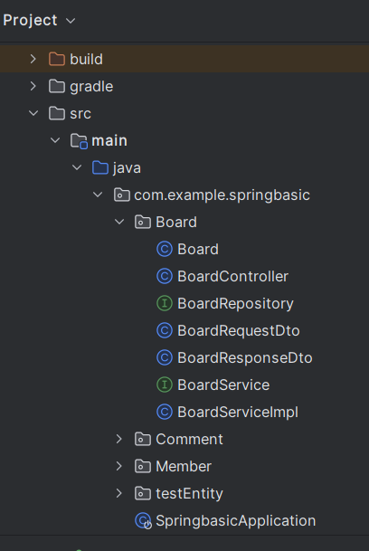
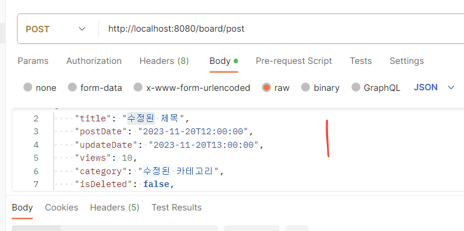
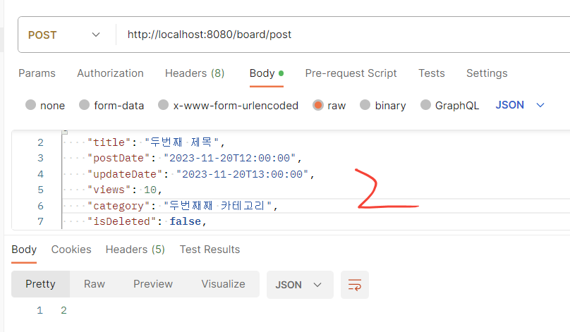
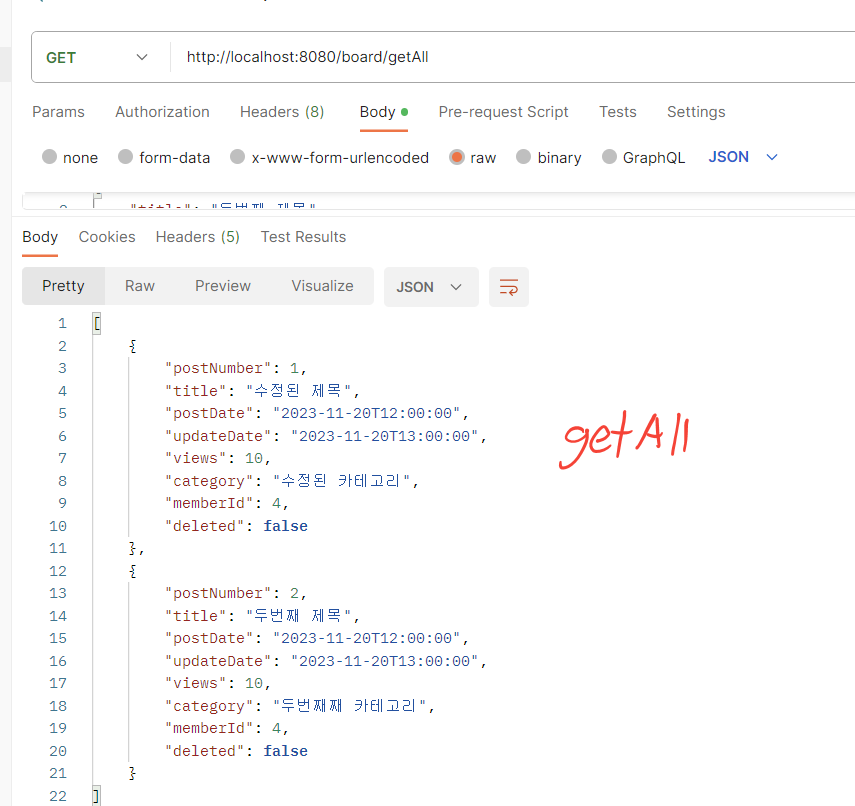
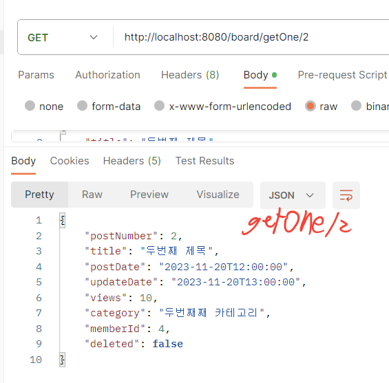
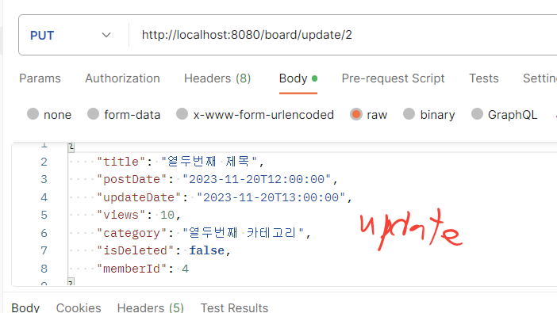
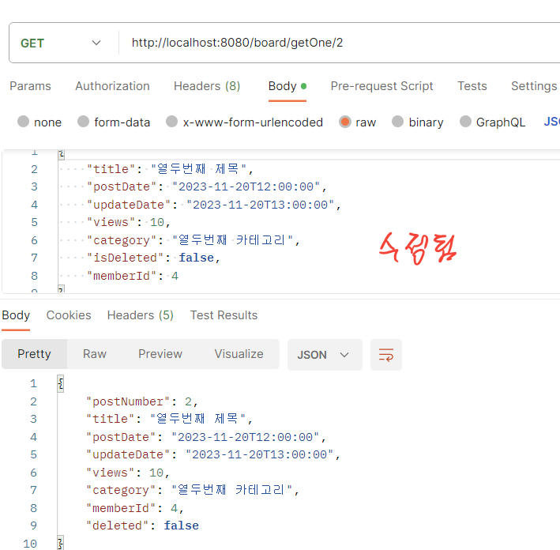
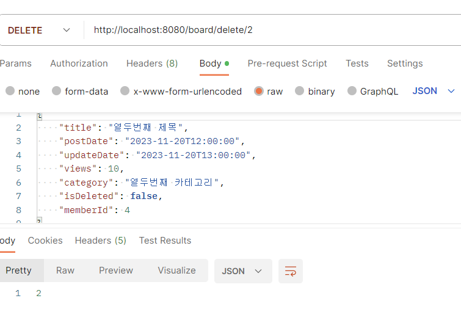
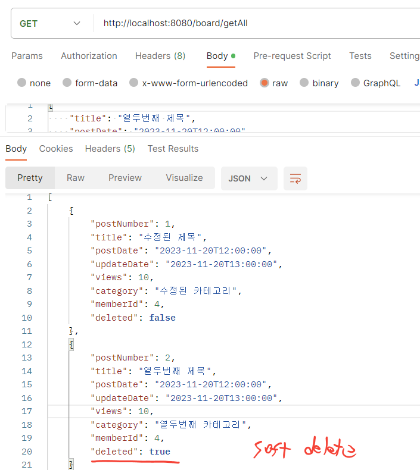

<br>

# JPA 활용해서 게시판 엔티티 CRUD 구현하기

<br><br>

###### 저번주에 만든 게시판 엔티티를 C(reate), R(ead), U(pdate), D(elete)로 구현하는 과제를 수행했다.

<br>

CRUD 작업은 POSTMAN 이라는 툴을 이용했다 간단히 말하면 REST API를 구축할 수 있게 해주고 백엔드 작업을 하면서 쉽게 프론트 업무도 할 수 있는 툴이라고 들었다. 처음으로 사용해보니까 낯설었지만 처음부터 404에러가 떠서 첫인상이 좋지 않았다.

<br><br>

일단 저번에 만든 Board.java를 보자

>```java
>package com.example.springbasic.Board;
>
>import com.example.springbasic.Member.Member;
>import jakarta.persistence.*;
>import lombok.AllArgsConstructor;
>import lombok.Builder;
>import lombok.Getter;
>import lombok.NoArgsConstructor;
>import org.springframework.data.annotation.CreatedDate;
>import org.springframework.data.annotation.LastModifiedDate;
>import org.springframework.web.ErrorResponse;
>
>import java.time.LocalDateTime;
>
>@Getter
>@Entity
>@Builder
>@AllArgsConstructor
>@NoArgsConstructor
>@Table(name = "boards")
>public class Board {
>
>
>    @Id
>    @GeneratedValue(strategy = GenerationType.IDENTITY)
>    private Long postNumber;
>
>    @Column(name = "title", nullable = false, length = 255)
>    private String title;
>
>    @CreatedDate
>    @Column(name = "post_date", nullable = false, updatable = false)
>    private LocalDateTime postDate;
>
>    @LastModifiedDate
>    @Column(name = "update_date", nullable = false)
>    private LocalDateTime updateDate;
>
>    @Column(name = "views", nullable = false)
>    private int views;
>
>    @Column(name = "category", length = 50)
>    private String category;
>
>    @Column(name = "is_deleted")
>    private boolean isDeleted = false;
>
>
>    
>    @Column(name = "member_id")
>    private Long memberId;
>
>    public void softDelete() {
>        this.isDeleted = true;
>    }
>
>
>    public void update(String title, LocalDateTime postDate, LocalDateTime updateDate,
>                       int views, String category, boolean isDeleted, Long memberId) {
>        this.title = title;
>        this.postDate = postDate;
>        this.updateDate = updateDate;
>        this.views = views;
>        this.category = category;
>        this.isDeleted = isDeleted;
>        this.memberId = memberId;
>    }
>
>}
>
>```

 <br>

간단히 보면 저번 주 코드에서 빌더와 생성자관리 해주는 어노테이션을 추가하고 updatet라는 메소드를 구현했다. 그리고 soft delete를 구현하기위한 코드도 만들어 줬다.  
 soft delete는 데이터를 완전히 삭제하는 것이 아니라 true, false 타입으로 나눠서 구분하는 것이다. 완전히 데이터를 삭제하면 그 데이터를 쓰고 있는 다른 부분에서 문제가 생길 수 있어서 soft delete를 사용하는것이 좋다고 한다

<br><br>


다음 코드는 application.yml

>```java
>spring:
>    datasource:
>        driver-class-name: com.mysql.cj.jdbc.Driver
>        url: jdbc:mysql://localhost:3306/gdsc?serverTimezone=Asia/Seoul
>        username: root
>        password: 1234
>
>    jpa:
>        show-sql: true
>        hibernate:
>            ddl-auto: create
>
>        properties:
>            format_sql: true
>
>        open-in-view: false
>
>    mvc:
>        throw-exception-if-no-handler-found: true
>    web:
>        resources:
>            add-mappings: false
>```
>
>

<br>

구글링해서 일단 이것저것 붙여놨다

<br>

<br>

다음은 

>```
>dependencies {
>    implementation 'org.springframework.boot:spring-boot-starter-data-jdbc'
>    implementation 'org.springframework.boot:spring-boot-starter-data-jpa'
>    implementation 'org.springframework.boot:spring-boot-starter-web'
>    compileOnly 'org.projectlombok:lombok'
>    developmentOnly 'org.springframework.boot:spring-boot-devtools'
>    runtimeOnly 'com.mysql:mysql-connector-j'
>    annotationProcessor 'org.projectlombok:lombok'
>    implementation 'mysql:mysql-connector-java:8.0.28'
>    testImplementation 'org.springframework.boot:spring-boot-starter-test'
>}
>```

의존성도 필요해보이는 것들 다 추가 했다. 그리고 이번에 lombok이 쓰인다.

<br>

<br>

이제 파일 구조를 보면서 새로 생긴 코드를 살펴보자



<br>

일단 게시판만 구현하는 것이기 때문에 Board패키지에 다 몰아 넣었다. 그리고 살짝 주의 할 점은 메인을 포함하고 있는 파일(SpringbasicApplication)이 작업하고 있는 패키지나 파일보다 하위에 위치하면 나중에 포스트맨에서 오류난다고 한다.

<br><br>

**BoardRepository.java**

>```java
>package com.example.springbasic.Board;
>
>import org.springframework.data.jpa.repository.JpaRepository;
>import org.springframework.stereotype.Repository;
>
>@Repository
>public interface BoardRepository extends JpaRepository<Board, Long> {
>
>}
>```
>
>

BoardRepository는 JpaRepository를 상속받아서 사용한다

<br><br>

**BoardRequestDto.java**

>package com.example.springbasic.Board;
>
>import lombok.Getter;
>import org.springframework.format.annotation.DateTimeFormat;
>
>import java.time.LocalDateTime;
>
>@Getter
>public class BoardRequestDto {
>
>```java
>private String title;
>private LocalDateTime postDate;
>private LocalDateTime updateDate;
>private int views;
>private String category;
>private boolean isDeleted;
>private Long memberId;
>
>public Board toEntity() {
>    return Board.builder()
>            .title(title)
>            .postDate(postDate)
>            .updateDate(updateDate)
>            .views(views)
>            .category(category)
>            .isDeleted(isDeleted)
>            .memberId(memberId)
>            
>            .build();
>}
>
>```
>}

빌더 패턴을 이용하고 @Getter를 선언한다

<br><br>

**BoardResponseDto.java**

>```java
>package com.example.springbasic.Board;
>
>import lombok.Getter;
>
>import java.time.LocalDateTime;
>
>@Getter
>public class BoardResponseDto {
>
>    private Long postNumber;
>    private String title;
>    private LocalDateTime postDate;
>    private LocalDateTime updateDate;
>    private int views;
>    private String category;
>    private boolean isDeleted;
>    private Long memberId;
>
>    public BoardResponseDto(Board board) {
>        this.postNumber = board.getPostNumber();
>        this.title = board.getTitle();
>        this.postDate = board.getPostDate();
>        this.updateDate = board.getUpdateDate();
>        this.views = board.getViews();
>        this.category = board.getCategory();
>        this.isDeleted = board.isDeleted();
>        this.memberId = board.getMemberId();
>
>    }
>
>}
>```
>
>

서버에 요청이 오면 데이터를 저장해둔다. 이렇게 request와 response 를 둘이 나눠서 코드를 짜는 것이 효율적이다

<br><br>

**BoardService.java**

>```
>package com.example.springbasic.Board;
>
>import java.util.List;
>
>public interface BoardService {
>
>    Long createBoard(BoardRequestDto request);
>
>    List<BoardResponseDto> getAllBoards();
>
>    BoardResponseDto getBoardById(Long id);
>
>    Long updateBoard(Long id, BoardRequestDto request);
>
>    Long deleteBoard(Long id);
>
>}
>```
>
>

서비스를 구현하기 전에 만든 인터페이스이다

<br><br>

**BoardServiceImpl.java**

>```
>package com.example.springbasic.Board;
>
>import org.springframework.beans.factory.annotation.Autowired;
>import org.springframework.stereotype.Service;
>import org.springframework.transaction.annotation.Transactional;
>
>import java.util.List;
>import java.util.Optional;
>import java.util.stream.Collectors;
>
>@Service
>@Transactional(readOnly = true)
>public class BoardServiceImpl implements BoardService {
>
>    private final BoardRepository boardRepository;
>
>    @Autowired
>    public BoardServiceImpl(BoardRepository boardRepository) {
>        this.boardRepository = boardRepository;
>    }
>
>    @Override
>    @Transactional
>    public Long createBoard(BoardRequestDto request) {
>        Board board = request.toEntity();
>        Board savedBoard = boardRepository.save(board);
>        return savedBoard.getPostNumber();
>    }
>
>    @Override
>    public List<BoardResponseDto> getAllBoards() {
>        List<Board> boards = boardRepository.findAll();
>        return boards.stream()
>                .map(BoardResponseDto::new)
>                .collect(Collectors.toList());
>    }
>
>    @Override
>    public BoardResponseDto getBoardById(Long id) {
>        Optional<Board> boardId = boardRepository.findById(id);
>        Board board = boardId.orElseThrow(() -> new RuntimeException("Board not found with id: " + id));
>        return new BoardResponseDto(board);
>    }
>
>    @Override
>    @Transactional
>    public Long updateBoard(Long id, BoardRequestDto request) {
>        Board board = boardRepository.findById(id)
>                .orElseThrow(() -> new RuntimeException("Board not found with id: " + id));
>
>
>        board.update(request.getTitle(), request.getPostDate(), request.getUpdateDate(),
>                request.getViews(), request.getCategory(), request.isDeleted(), request.getMemberId());
>
>        return board.getPostNumber();
>    }
>
>
>    @Override
>    @Transactional
>    public Long deleteBoard(Long id) {
>        Board board = boardRepository.findById(id)
>                .orElseThrow(() -> new RuntimeException("Board not found with id: " + id));
>
>        // Soft delete 수행
>        board.softDelete();
>
>        return board.getPostNumber();
>    }
>}
>```
>
>

인터페이스를 구현한 클래스로 컨트롤러에서 사용할 메소드를 정의하는 것이다. 솔직히 서비스 구현하는 코드짜기가 너무 힘들어서 여기저기서 많이 참고했다. 그리고 delete 부분에서 아까 Board.java에 있는 softDelete()를 호출 시킨다. 그래서 삭제되면 true가 출력된다.

<br><br>

**BoardController.java**

>```java
>package com.example.springbasic.Board;
>
>import com.example.springbasic.Board.BoardRequestDto;
>import com.example.springbasic.Board.BoardResponseDto;
>import com.example.springbasic.Board.BoardService;
>import lombok.RequiredArgsConstructor;
>import org.springframework.transaction.annotation.Transactional;
>import org.springframework.web.bind.annotation.*;
>
>import java.util.List;
>
>@RestController
>@RequiredArgsConstructor
>@RequestMapping("/board")
>public class BoardController {
>
>    private final BoardService boardService;
>
>    @Transactional
>    @PostMapping("/post")
>    public Long createBoard(@RequestBody BoardRequestDto request) {
>        return boardService.createBoard(request);
>    }
>
>    @GetMapping("/getAll")
>    public List<BoardResponseDto> findAllBoards() {
>        return boardService.getAllBoards();
>    }
>
>    @GetMapping("/getOne/{id}")
>    public BoardResponseDto findBoardById(@PathVariable Long id) {
>        return boardService.getBoardById(id);
>    }
>
>    @Transactional
>    @PutMapping("/update/{id}")
>    public Long updateBoard(@PathVariable Long id, @RequestBody BoardRequestDto request) {
>        return boardService.updateBoard(id, request);
>    }
>
>    @Transactional
>    @DeleteMapping("/delete/{id}")
>    public Long deleteBoard(@PathVariable Long id) {
>        return boardService.deleteBoard(id);
>    }
>}
>```
>
>

@RestController와 @RequestMapping("/board")을 꼭 선언해주고 /post, /getAll, /getOne/{id}, /update/{id}, /delete/{id}들이 각각 매핑할 엔드 포인트가 된다.

<br><br>


**이제 POSTMAN으로 CRUD를 구현해보자**

먼저 경로 설정이 굉장히 중요하다. 안 그러면 404, 405, 500 다양한 오류들을 만날 수 있을 것이다. 

<br>

먼저 **POST** 로 2가지 데이터를 넣어보겠다

---






<br><br>

이제 조회를 해보자. 조회는 두가지 방법이 있는데 전체데이터를 보거나 특정 데이터만 보는 것이다. 나는 코드에서 전체를 **/getAll**로,  
특정 데이터를 **/getOne/{id}**로 설정했다.

---





<br><br>

다음은 데이터를 **update** 해보자 

---



PUT으로 설정하고 update 한 다음 다시 조회를 해보면 데이터가 수정되어있다.

<br>



<br><br>

마지막은 **delete** 하는 작업이다. 타입을 delete로 바꿔두고 /delete/postNumber를 입력하면 delete 여부가 false에서 true로 바뀐다.

---





<br>

<br>

<br>

이번 과제도 많이 힘들었다. dto, service, controller, repository 코드를 짜면서 계속 하나씩 오류가 생겼는데 하나 고치면 다른데서 난리고 그런 과정의 연속이었다. 그래서 2번정도 코드를 다 갈아엎고 다시 시작했다. 마지막에는 구글링과 챗gpt의 힘을 많이 빌려서 완성했다. 앞으로 과제를 수행하기 위해서 더욱 열심히 공부해야겠다.


