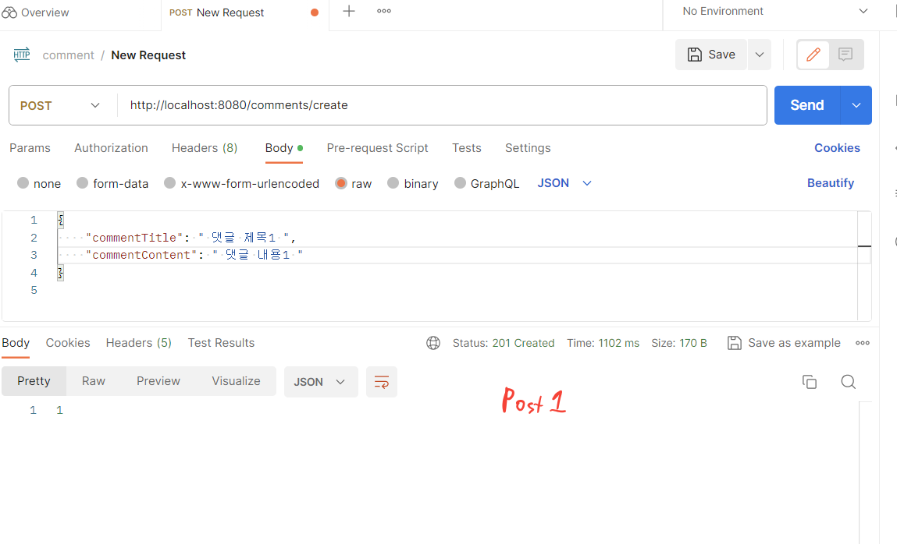
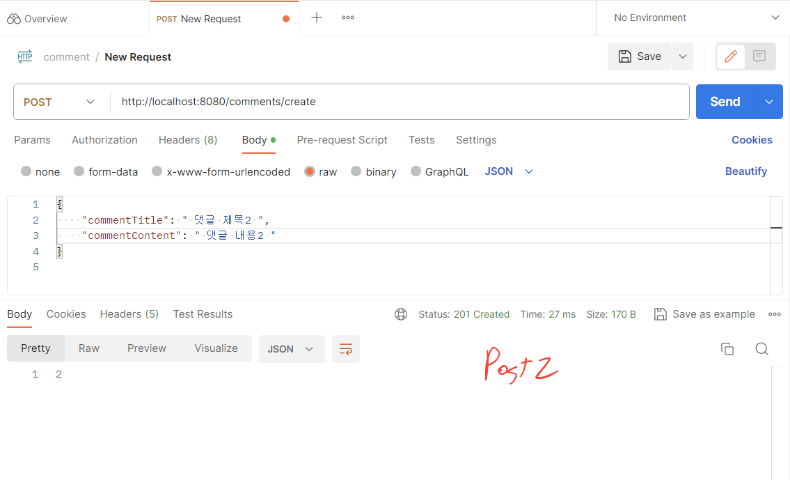
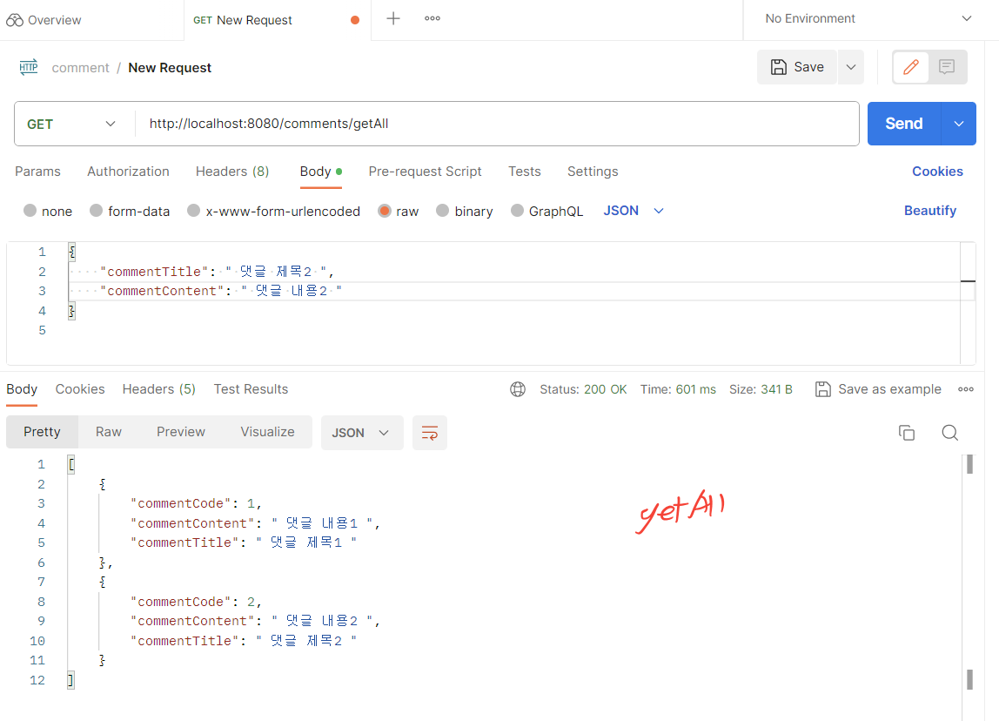
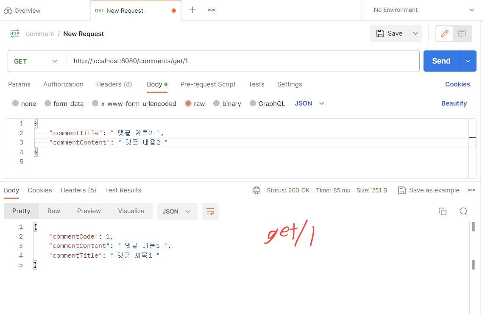
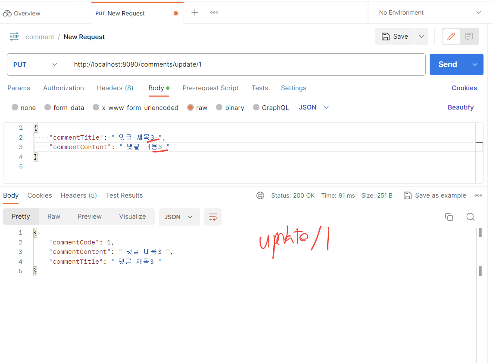
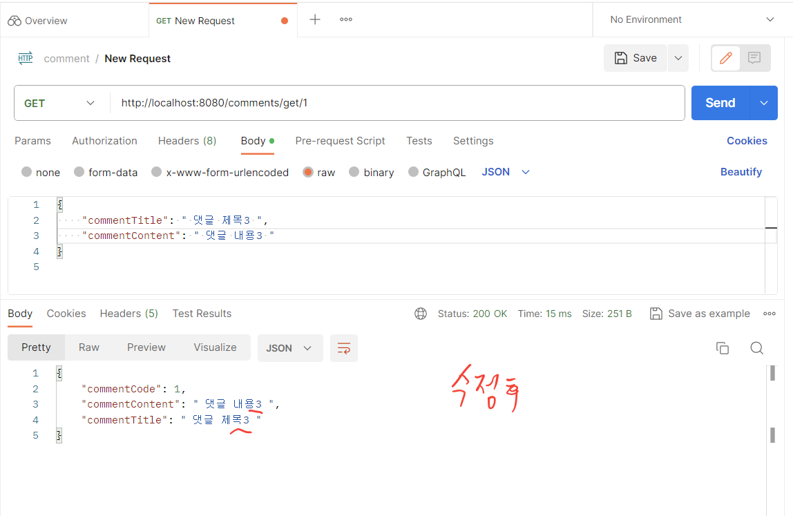
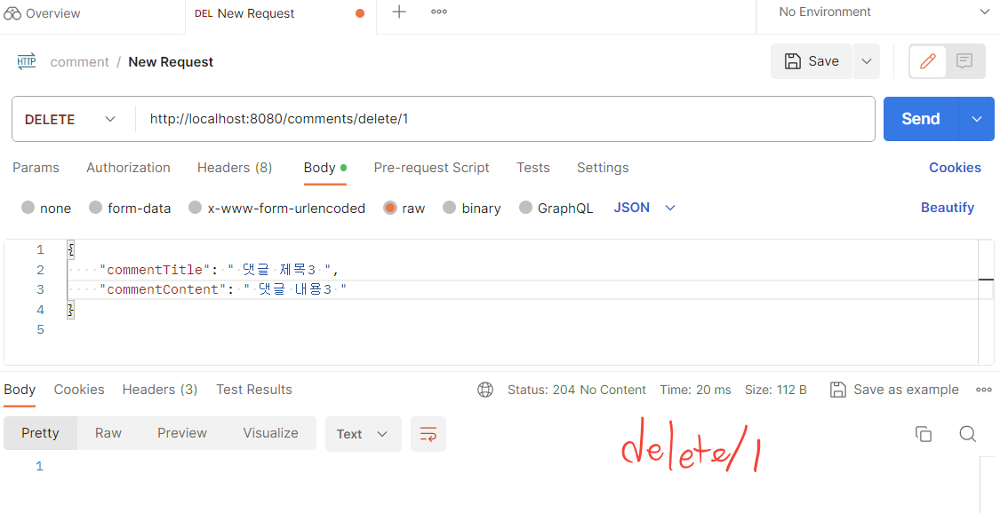
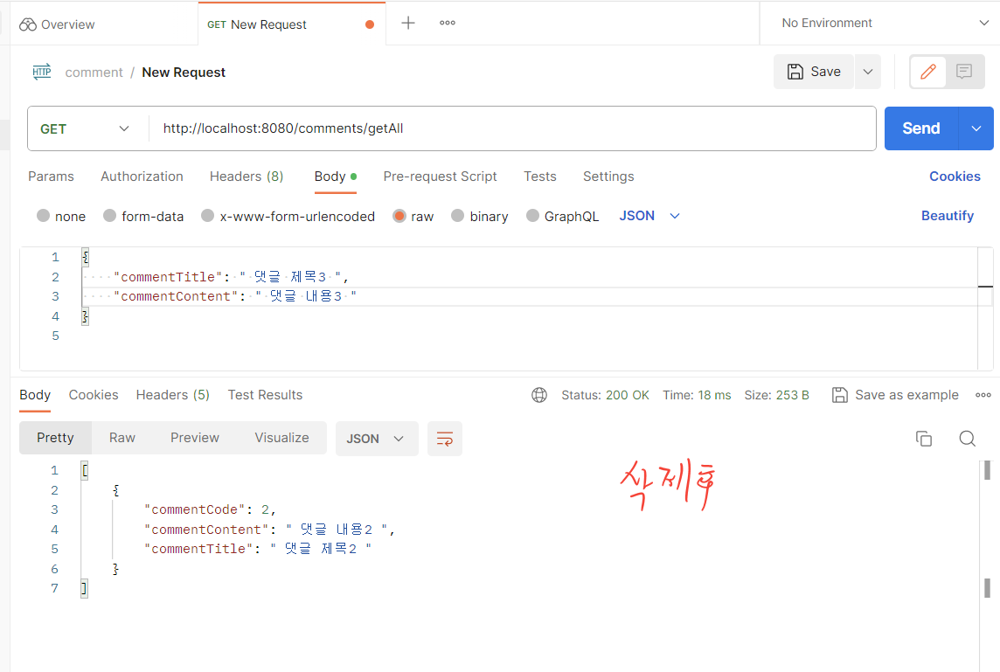
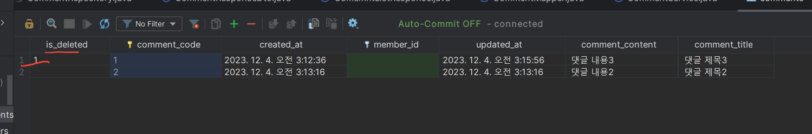

<br>

# JPA 활용해서 댓글 엔티티 CRUD 구현하기

<br><br>

###### 저번 과제에서는 게시판 엔티티를 생성하고 CRUD를 구현해보고 수정하는 작업을 수행했다. 그 과정에서 배운것을 토대로 이번에 댓글 엔티티를 구현해봤다.

<br>

먼저 **Comment.java**를 보

```java
package com.example.springbasic.Comment;

import com.example.springbasic.Member.Member;
import org.springframework.data.annotation.CreatedDate;
import org.springframework.data.annotation.LastModifiedDate;

import jakarta.persistence.*;
import lombok.AllArgsConstructor;
import lombok.Builder;
import lombok.Getter;
import lombok.NoArgsConstructor;
import org.hibernate.annotations.Where;
import org.springframework.data.annotation.CreatedDate;
import org.springframework.data.annotation.LastModifiedDate;
import org.springframework.data.jpa.domain.support.AuditingEntityListener;
import jakarta.persistence.EntityListeners;
import jakarta.persistence.MappedSuperclass;
import java.time.LocalDateTime;

@Getter
@Entity
@Builder
@AllArgsConstructor
@NoArgsConstructor
@EntityListeners(value = {AuditingEntityListener.class})
@Where(clause = "is_deleted is null")
@Table(name = "comments")
public class Comment {

    @Id
    @GeneratedValue(strategy = GenerationType.IDENTITY)
    private Long commentCode;

    @Column(nullable = false)
    private String commentTitle;

    @Column(nullable = false)
    private String commentContent;

    @CreatedDate
    private LocalDateTime createdAt;

    @LastModifiedDate
    private LocalDateTime updatedAt;

    @ManyToOne
    @JoinColumn(name = "member_id")
    private Member member;

    private Boolean isDeleted ;

    public void softDelete() {
        this.isDeleted = true;
    }

    public void update(String commentTitle, String commentContent) {
        this.commentTitle = commentTitle;
        this.commentContent = commentContent;
    }

    public void delete() {
        this.isDeleted = true;
    }

}
```

<br>

게시판 엔티티에서는 따로 시간을 받아주는 추상클래스를 만들어서 상속받은 다음에 구현했지만 댓글 엔티티에서는 한 클래스에 다 넣어봤다.  

그리고 여기에도 soft delete를 구현하기 위해 Boolean isDeleted를 설정해두고 삭제하는 메소드를 구현해봤다.

<br>

<br>


다음은 DTO를 만들어보자  
게시판에서는 request와 response를 한 코드에 다 썼는데 이번에는 좀 나눠봤다.

<br>

**CommentCreateRequestDto.java**

```java
package com.example.springbasic.Comment;

import com.example.springbasic.Member.Member;

import lombok.AllArgsConstructor;
import lombok.Getter;
import lombok.NoArgsConstructor;

@Getter
@AllArgsConstructor
@NoArgsConstructor
public class CommentCreateRequestDto {
    private String commentTitle;
    private String commentContent;
}

```

<br>

**CommentUpdateRequestDto.java**

```java
package com.example.springbasic.Comment;


import lombok.Builder;
import lombok.Getter;
import lombok.NoArgsConstructor;

@Getter
@NoArgsConstructor
public class CommentUpdateRequestDto {
    private Long commentCode;
    private String commentTitle;
    private  String commentContent;

    @Builder
    public CommentUpdateRequestDto(Long commentCode, String commentTitle, String commentContent) {
        this.commentCode = commentCode;
        this.commentTitle = commentTitle;
        this.commentContent = commentContent;
    }
}

```

<br>

생성할 때와 수정할 때의 요청을 나눠서 만들어보았다. 업데이트할때 빌더가 있어야 오류가 안난다는데   
막상 코드 돌려보면 CommentUpdateRequestDto는 사용되지 않는다고 뜬다.  이 부분은 조금 더 봐야겠다.

<br>

<br>

다음은 Response 부분이다. 이것도 두개로 나눠보고 게시판 과제 할 때와 달리 Mapper 클래스를 만들어봤다.

<br>

**CommentListResponse.java**

```java
package com.example.springbasic.Comment;

import java.util.List;
import lombok.AllArgsConstructor;
import lombok.Builder;
import lombok.Getter;

@Getter
@Builder
@AllArgsConstructor
public class ComemntListResponse {
    private List<CommentResponse> commentList;
}

```

<br>

**CommentResponseDto.java**

```java
package com.example.springbasic.Comment;

import lombok.AllArgsConstructor;
import lombok.Builder;
import lombok.Getter;

@Getter
@Builder
@AllArgsConstructor
public class CommentResponseDto {

    private Long commentCode;

    private String commentContent;

    private String commentTitle;

}

```

<br>

Response는 되게 간단하다. 댓글 코드, 제목, 내용을 보여주며 리스트를 만들어줬다.

<br><br>

**CommentMapper.java**

```java
package com.example.springbasic.Comment;

import org.springframework.stereotype.Component;

import java.util.List;
import java.util.stream.Collectors;

@Component
public class CommentMapper {

    public Comment toEntity(CommentCreateRequestDto request) {
        return Comment.builder()
                .commentTitle(request.getCommentTitle())
                .commentContent(request.getCommentContent())
                .build();
    }

    public CommentResponseDto toResponse(Comment comment) {
        return CommentResponseDto.builder()
                .commentCode(comment.getCommentCode())
                .commentContent(comment.getCommentContent())
                .commentTitle(comment.getCommentTitle())
                .build();
    }

    public ComemntListResponse toListResponse(List<Comment> commentList) {
        List<CommentResponseDto> commentResponseDtoList =
                commentList.stream().map(this::toResponse).collect(Collectors.toList());
        return ComemntListResponse.builder()
                .commentList(commentResponseDtoList)
                .build();
    }

    public CommentUpdateRequestDto toUpdateRequestDto(Comment comment) {
        return CommentUpdateRequestDto.builder()
                .commentCode(comment.getCommentCode())
                .commentTitle(comment.getCommentTitle())
                .commentContent(comment.getCommentContent())
                .build();
    }
}

```

<br>

1. **toEntity 메서드:**
   - `CommentCreateRequestDto`를 받아서 `Comment` 엔터티로 변환합니다.
   - `Comment.builder()`를 사용하여 빌더 패턴을 활용하여 Comment 엔터티를 생성하고, 주어진 DTO의 필드 값을 엔터티에 설정합니다.
2. **toResponse 메서드:**
   - `Comment` 엔터티를 받아서 클라이언트에게 반환될 `CommentResponseDto`로 변환합니다.
   - 마찬가지로 빌더 패턴을 사용하여 DTO를 생성하고, 엔터티의 필드 값을 DTO에 설정합니다.
3. **toListResponse 메서드:**
   - `Comment` 엔터티로 이루어진 리스트를 받아서 이를 클라이언트에게 반환될 형태인 `CommentListResponse`로 변환합니다.
   - 리스트 내의 각각의 Comment 엔터티를 toResponse 메서드를 통해 CommentResponseDto로 변환하고, 이를 리스트로 묶어서 CommentListResponse에 설정합니다.
4. **toUpdateRequestDto 메서드:**
   - `Comment` 엔터티를 받아서 엔터티의 정보를 수정할 때 사용할 `CommentUpdateRequestDto`로 변환합니다.

<br>

이번에 매퍼를 처음 써봤는데 아직 완전히 무슨 느낌인지는 모르겠다. 중간에서 엔티티로 변환하고 Dto로 만들어준다는데 더 알아봐야겠다.

<br><br>

**CommentRepository.java**

```java
package com.example.springbasic.Comment;

import org.springframework.data.jpa.repository.JpaRepository;
import org.springframework.stereotype.Repository;
@Repository
public interface CommentRepository extends JpaRepository<Comment, Long> {
}
```

<br><br>

다음은 컨트롤러와 서비스 구현이다. 컨트롤러는 게시판과 비슷한 형식이지만 서비스는 인터페이스를 만들지 않고 바로 구현했다.

<br>

**CommentContreller.java**

```java
package com.example.springbasic.Comment;

import lombok.RequiredArgsConstructor;
import org.springframework.http.HttpStatus;
import org.springframework.http.ResponseEntity;
import org.springframework.web.bind.annotation.*;

import java.util.List;

@RestController
@RequiredArgsConstructor
@RequestMapping("/comments")
public class CommentController {

    private final CommentService commentService;

    @PostMapping("/create")
    public ResponseEntity<Long> createComment(@RequestBody CommentCreateRequestDto request) {
        Long commentCode = commentService.createComment(request);
        return ResponseEntity.status(HttpStatus.CREATED).body(commentCode);
    }

    @PutMapping("/update/{id}")
    public ResponseEntity<CommentResponseDto> updateComment(@RequestBody CommentUpdateRequestDto request, @PathVariable Long id) {
        CommentResponseDto updatedComment = commentService.updateComment(request,id);
        return ResponseEntity.ok(updatedComment);
    }

    @GetMapping("/getAll")
    public ResponseEntity<List<CommentResponseDto>> getAllComments() {
        List<CommentResponseDto> comments = commentService.getAllComments();
        return ResponseEntity.ok(comments);
    }

    @GetMapping("/get/{id}")
    public ResponseEntity<CommentResponseDto> getComment(@PathVariable Long id) {
        CommentResponseDto comment = commentService.getComment(id);
        return ResponseEntity.ok(comment);
    }

    @DeleteMapping("/delete/{id}")
    public ResponseEntity<Void> deleteComment(@PathVariable Long id) {
        commentService.deleteComment(id);
        return ResponseEntity.noContent().build();
    }
}

```

<br>

**CommentService.java**

```java
package com.example.springbasic.Comment;

import lombok.RequiredArgsConstructor;
import org.springframework.stereotype.Service;
import org.springframework.transaction.annotation.Transactional;

import java.util.List;
import java.util.stream.Collectors;

@Service
@RequiredArgsConstructor
public class CommentService {

    private final CommentRepository commentRepository;
    private final CommentMapper commentMapper;

    @Transactional
    public Long createComment(CommentCreateRequestDto request) {
        Comment comment = commentRepository.save(commentMapper.toEntity(request));
        return comment.getCommentCode();
    }

    @Transactional
    public CommentResponseDto updateComment(CommentUpdateRequestDto request, Long id) {
        Comment comment = commentRepository.findById(id)
                .orElseThrow(IllegalStateException::new);

        comment.update(request.getCommentTitle(), request.getCommentContent());
        return commentMapper.toResponse(comment);
    }


    public List<CommentResponseDto> getAllComments() {
        List<Comment> comments = commentRepository.findAll();
        return comments.stream()
                .map(commentMapper::toResponse)
                .collect(Collectors.toList());
    }

    public CommentResponseDto getComment(Long id) {
        Comment comment = commentRepository.findById(id).orElseThrow(IllegalStateException::new);
        return commentMapper.toResponse(comment);
    }

    @Transactional
    public void deleteComment(Long id) {
        Comment comment = commentRepository.findById(id).orElseThrow(IllegalStateException::new);
        comment.softDelete();
    }
}

```

<br>

저번에 피드백 받았던 부분인 예외처리를 명확하게 하기 위해 IllegalStateException을 사용했고 최대한 피드백 보완한 것으로 코드를 전체적으로 작성했는데 잘 했는지는 모르겠다.  
이제 포스트맨에서 확인해보자

<br>

<br>

###### POSTMAN 실습

<br>

**1. POST**

먼저 2개의 데이터를 생성해보자






<br>

2개의 데이터를 생성했고 이제 확인해보자

<br>

**2. GET**

<br>





<br>

데이터가 잘 들어간것을 확인했고 특정 데이터만 볼 수 있는것도 확인됐다.  
이제 수정을 해보자

<br>


**3. PUT**






<br>

수정도 잘되는 것을 볼 수 있다.  
마지막으로 삭제를 해보자

<br>

**4. DELETE**








<br>

테이블을 보니까 soft delete 된 것을 볼 수 있다.

<br>

<br>

이번 댓글 과제는 게시판을 한 다음에 하니까 조금은 수월하게 할 수 있었던 것 같다. 일단 코드가 잘 돌아가서 다행이지만 아직 모르는 부분이 많다. 앞으로 더 노력하자.

깃허브 링크: https://github.com/Seungkiii/gdscSpringStudy.git


